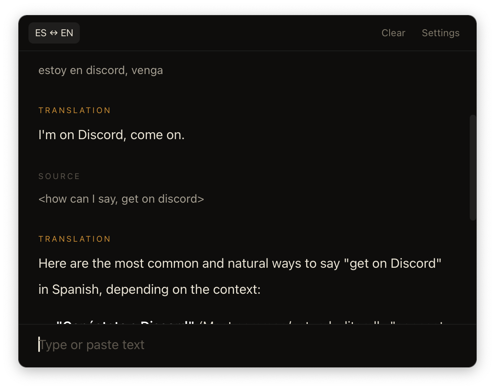

<p align="center">
  
</p>

<h1 align="center">Babelfish</h1>

<p align="center">
  Native macOS translator. Powered by OpenRouter.<br>
  Pick any model, write your own prompt, swap language pairs in one config file.
</p>

## Install

```bash
nix develop
cargo tauri build --bundles app
cp -r target/release/bundle/macos/Babelfish.app /Applications/
```

Open Babelfish and paste your OpenRouter API key in Settings.

## Configure

Edit `~/Library/Application Support/babelfish/config.json`. Changes reload on the next translation — no restart.

```json
{
  "api_key": "sk-or-...",
  "model": "zai-code/glm-5.1",
  "prompt_template": "Translate from ${from_lang} to ${to_lang}. Output only the translation.",
  "language_pairs": [
    { "name": "es_en", "label": "ES ↔ EN", "from_lang": "Spanish", "to_lang": "English" },
    { "name": "pt_en", "label": "PT ↔ EN", "from_lang": "Portuguese", "to_lang": "English" }
  ]
}
```

`${from_lang}` and `${to_lang}` get replaced per language pair before the prompt is sent.

## Shortcuts

| Key             | Action      |
| --------------- | ----------- |
| Enter           | Translate   |
| Shift+Enter     | New line    |
| Click on text   | Copy        |
